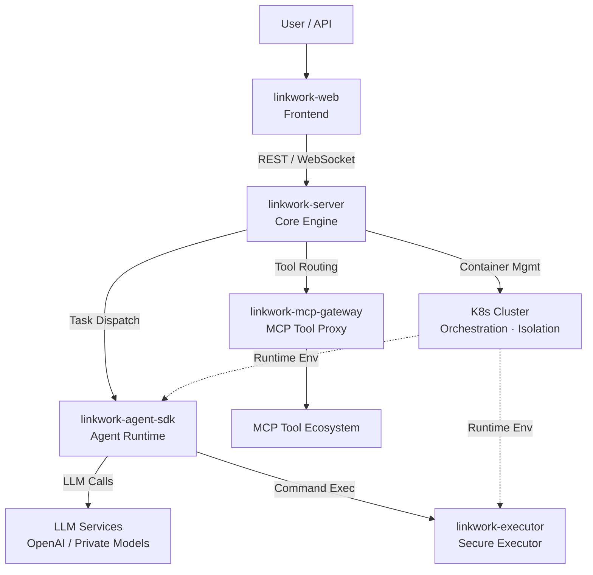

<div align="center">

# LinkWork

### Make AI Work Like Your Team

**Open-source enterprise AI workforce platform — Roles · Skills · Tools · Security · Scheduling, all in one place**

English | [中文](./README_zh-CN.md)

</div>

---

## What Is LinkWork

LinkWork is an open-source **AI workforce management platform**.

You can run it like a company: create **roles**, equip each role with **skills**, authorize available **tools**, set **security policies**, arrange **shift schedules** — then let your AI workers run 24/7 in their own isolated containers, track progress in real time, and automatically intercept high-risk operations for human approval.

Not a chatbot. Not a personal assistant. An **enterprise-grade AI team management system**.

> Before paying AI a salary, give it a role, a skill set, and a security policy.

## Core Design Philosophy

### Every AI Worker Is a Containerized Service

An AI worker isn't a process running on the host machine. Each AI worker runs in an independent **Docker / K8s container** with:

- **Isolated execution environment** — Filesystem, network, and processes fully isolated between workers
- **Dedicated resource quotas** — CPU and memory allocated on demand, preventing any single worker from crashing the cluster
- **Persistent workspace** — Task outputs, intermediate state, and long-term memory preserved across sessions
- **Fixed skill configuration** — Install capabilities like apps — they persist across restarts
- **Policy-controlled command boundaries** — Policy engine governs what each worker can and cannot execute

Manage your AI team like a microservice cluster: scaling, canary releases, resource monitoring, fault recovery — all leveraging the K8s ecosystem.

### Skill & Tool Marketplace: The App Store for AI Capabilities

LinkWork breaks down AI capabilities into three governable layers, managed like an App Store:

**Role** — A complete AI worker definition
> Includes persona, job description, available skill list, and tool permissions. Create a "Frontend Engineer" role, and any AI model instance can start working immediately.

**Skill** — Installable capability modules
> Declaratively defined, with version management and hot-loading. "Code Review", "Data Analysis", "Document Writing" are independent skills, mix and match across roles.

**MCP Tool** — Standardized external capability access
> Compatible with the [Model Context Protocol](https://modelcontextprotocol.io/) standard. Database queries, API calls, file operations, browser control — all accessed through a unified tool bus with automatic proxy, auth, and metering.

```
Role Marketplace        Skill Marketplace       Tool Marketplace
┌──────────────┐     ┌──────────────┐     ┌──────────────┐
│ FE Engineer   │────▶│ Code Review   │────▶│ GitHub API   │
│ Data Analyst  │     │ Unit Testing  │     │ Database     │
│ DevOps Eng.   │     │ Doc Writing   │     │ Slack        │
│ Security Aud. │     │ Data Cleaning │     │ Jira         │
│ ...           │     │ ...           │     │ ...          │
└──────────────┘     └──────────────┘     └──────────────┘
  Choose Role     →    Install Skills   →   Authorize Tools
```

Roles use Skills. Skills call Tools. Three decoupled layers, freely composable, **access-controlled** — enterprise admins decide which roles can use which skills and tools, rather than the AI installing whatever it wants.

## Key Features

- **Containerized Service Orchestration** — Each AI worker runs in its own container, K8s-native scheduling with elastic scaling and self-healing
- **AI Role Management** — Define job responsibilities and capability boundaries; swap workers without changing roles
- **Skill Marketplace** — Declarative skills with hot-loading and version management, install like apps
- **MCP Tool Bus** — Compatible with [MCP protocol](https://modelcontextprotocol.io/) standard, unified proxy, auth, and usage metering
- **Task Orchestration & Real-time Tracking** — Dispatch tasks, watch execution via WebSocket streaming, fully observable
- **Security Approval Workflow** — Risk-tiered policy engine, high-risk operations auto-intercepted, proceed only after human confirmation
- **Scheduled Shifts** — Cron-driven, AI workers execute on schedule without manual triggering
- **Vector Memory** — Milvus-based long-term memory, cross-task knowledge accumulation and semantic retrieval
- **Multi-model Support** — Compatible with OpenAI API standard, freely switch underlying models

## Architecture



**How it works**: User creates a task → Core engine allocates a container in the K8s cluster → Agent runtime starts in an isolated environment → Calls LLM for reasoning, securely executes commands through the executor → MCP gateway proxies external tool calls → Execution status streams back in real time.

## How It Differs from Personal AI Agents

Projects like OpenClaw are excellent personal AI assistants — running on your laptop, one Agent handling your daily tasks. LinkWork addresses a different level of the problem:

| | Personal AI Assistants (e.g. OpenClaw) | LinkWork |
|---|--------------------------------------|----------|
| **Positioning** | Personal productivity tool | Enterprise workforce platform |
| **Scale** | Single user, single Agent | Multi-team, multiple AI workers in parallel |
| **Runtime Env** | Local single machine | K8s cluster, container isolation |
| **Capability Mgmt** | Community plugins, self-install | Role → Skill → Tool, three-tier governance |
| **Security** | Relies on user discretion | Approval workflow + policy engine + audit |
| **Deployment** | `npm install -g` | Docker Compose / K8s |

> Personal assistants solve "my productivity". LinkWork solves "organizational effectiveness".

## Components

| Component | Language | Description | Repo | Status |
|-----------|----------|-------------|------|--------|
| **linkwork-server** | Java 21 / Spring Boot 3 | Core backend — task scheduling, role management, approvals, skill & tool registry | [GitHub](https://github.com/glowdan/linkwork-server) | Open-sourcing |
| **linkwork-executor** | Go | Secure executor — in-container command execution, policy engine, SSH isolation | [GitHub](https://github.com/glowdan/linkwork-executor) | Coming soon |
| **linkwork-agent-sdk** | Python | Agent runtime — LLM engine, skill orchestration, MCP integration | [GitHub](https://github.com/glowdan/linkwork-agent-sdk) | Coming soon |
| **linkwork-mcp-gateway** | Go | MCP tool gateway — tool discovery, request proxy, auth, usage metering | [GitHub](https://github.com/glowdan/linkwork-mcp-gateway) | Coming soon |
| **linkwork-web** | Vue 3 + TypeScript | Frontend reference — task dashboard, role config, skill marketplace | [GitHub](https://github.com/glowdan/linkwork-web) | Coming soon |

## Open-source Roadmap

LinkWork follows a **phased open-source** strategy, ensuring each component is independently usable and well-documented:

| Phase | Components | Description |
|-------|-----------|-------------|
| Phase 1 | linkwork-server | Java backend core with full scheduling engine and demo launcher |
| Phase 2 | linkwork-executor + linkwork-agent-sdk | Execution layer — Go secure executor + Python Agent runtime |
| Phase 3 | linkwork-mcp-gateway + linkwork-web | Access layer — MCP tool gateway + frontend reference implementation |

> Components are being actively prepared for release. Watch this repo for updates.

## License

[Apache License 2.0](./LICENSE)

## Stay Connected

The project is being actively open-sourced. If you're interested in enterprise AI workforce management:

- **Star** this repo to track progress
- **Watch** for release notifications
- Feel free to share ideas and suggestions in Issues

---

<div align="center">

**LinkWork** — Not just an AI assistant. An AI team.

</div>
