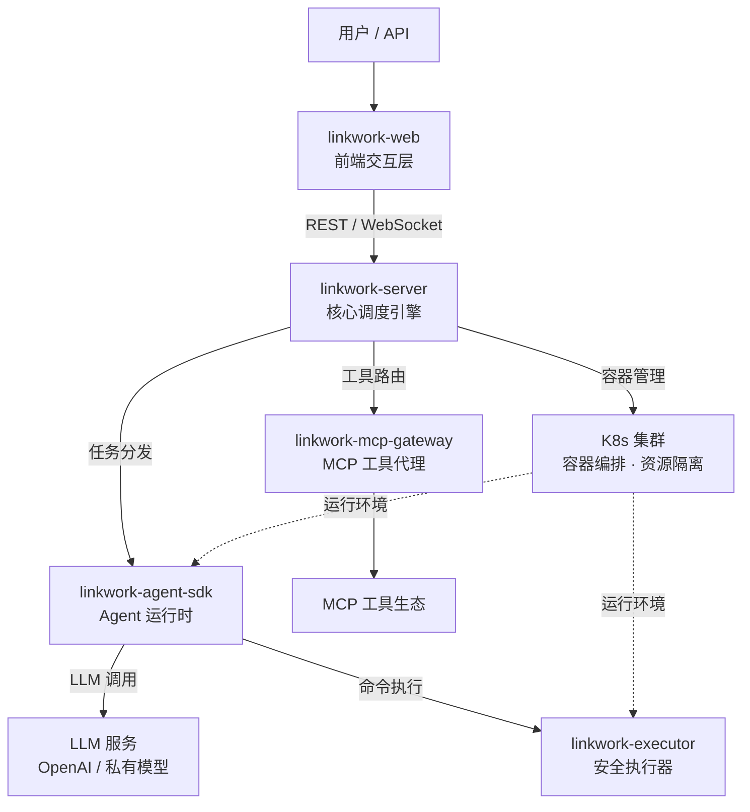

<div align="center">

# LinkWork

### 让 AI 像员工一样工作

**开源的企业级 AI 劳动力平台 — 岗位 · 技能 · 工具 · 安全 · 调度，一站式管理你的 AI 团队**

[English](./README.md) | 中文

</div>

---

## 这是什么

LinkWork 是一个开源的 **AI 劳动力管理平台**。

你可以像经营一家公司一样管理 AI：设立**岗位**，为每个岗位装配**技能**，授权可用的**工具**，设定**安全策略**，安排**排班计划** — 然后让 AI 员工在各自独立的容器中 7x24 运行，实时追踪进度，高风险操作自动拦截审批。

不是一个聊天机器人，不是一个个人助手，而是一个**企业级的 AI 团队管理系统**。

> 给 AI 发工资之前，先给它一个岗位、一套技能、一条安全红线。

## 核心设计理念

### 每个 AI 员工都是一个容器化服务

AI 员工不是一个跑在宿主机上的进程。每个 AI 员工在独立的 **Docker / K8s 容器**中运行，拥有：

- **隔离的执行环境** — 文件系统、网络、进程完全隔离，员工之间互不干扰
- **专属的资源配额** — CPU、内存按需分配，防止单个员工拖垮整个集群
- **持久化的工作空间** — 任务产出、中间状态、长期记忆跨会话保留
- **固定的技能配置** — 像安装 App 一样为员工装配能力，重启不丢失
- **策略化的命令边界** — 策略引擎控制每个员工能执行什么、不能执行什么

像管理微服务集群一样管理 AI 团队：扩缩容、灰度发布、资源监控、故障恢复，全部复用 K8s 生态。

### 技能 & 工具市场：AI 能力的 App Store

LinkWork 将 AI 能力拆解为三层可治理的模块，像 App Store 一样管理：

**岗位 (Role)** — 一个完整的 AI 员工定义
> 包含人设、职责描述、可用技能列表和工具权限。创建一个"前端开发工程师"岗位，任何 AI 模型实例化后都能直接上岗。

**技能 (Skill)** — 可装卸的能力模块
> 声明式定义，支持版本管理、热加载。"代码审查"、"数据分析"、"文档撰写"都是独立技能，按需组合安装到不同岗位。

**MCP 工具** — 标准化的外部能力接入
> 兼容 [Model Context Protocol](https://modelcontextprotocol.io/) 标准。数据库查询、API 调用、文件操作、浏览器控制……通过统一的工具总线接入，自动代理、鉴权、计量。

```
岗位市场                技能市场                工具市场
┌──────────┐     ┌──────────────┐     ┌──────────────┐
│ 前端工程师  │────▶│ 代码审查       │────▶│ GitHub API   │
│ 数据分析师  │     │ 单元测试       │     │ Database     │
│ 运维工程师  │     │ 文档撰写       │     │ Slack        │
│ 安全审计员  │     │ 数据清洗       │     │ Jira         │
│ ...       │     │ ...          │     │ ...          │
└──────────┘     └──────────────┘     └──────────────┘
  选择岗位     →     装配技能      →     授权工具
```

岗位选用技能，技能调用工具。三层解耦、自由组合、**权限可控** — 企业管理员决定哪些岗位可用哪些技能和工具，而不是 AI 自己随意安装。

## 核心能力

- **容器化服务编排** — 每个 AI 员工独立容器运行，K8s 原生调度，弹性扩缩容、故障自愈
- **AI 岗位管理** — 定义岗位职责与能力边界，AI 员工开箱即用、换人不换岗
- **技能市场** — 声明式技能，热加载、版本管理，像 App 一样按需安装
- **MCP 工具总线** — 兼容 [MCP 协议](https://modelcontextprotocol.io/)标准，统一代理、鉴权、用量统计
- **任务编排与实时追踪** — 下发任务，WebSocket 流式查看执行过程，全程可观测
- **安全审批流** — 风险分级策略引擎，高风险操作自动拦截，人工确认后继续
- **定时排班** — Cron 驱动，AI 员工按排班表自动执行，无需人工触发
- **向量记忆** — 基于 Milvus 的长期记忆，跨任务知识沉淀与语义检索
- **多模型支持** — 兼容 OpenAI 接口标准，自由切换底层模型

## 架构概览



**工作流程**：用户创建任务 → 调度引擎在 K8s 集群中分配容器 → Agent 运行时在隔离环境中启动 → 调用 LLM 推理、通过执行器安全执行命令 → MCP 网关代理外部工具调用 → 全程实时回传执行状态。

## 与个人 AI Agent 的区别

OpenClaw 等项目是优秀的个人 AI 助手 — 跑在你的笔记本上，一个 Agent 帮你处理日常事务。LinkWork 解决的是不同层级的问题：

| | 个人 AI 助手（如 OpenClaw） | LinkWork |
|---|-------------------------|----------|
| **定位** | 个人效率工具 | 企业劳动力平台 |
| **规模** | 单人单 Agent | 多团队、多 AI 员工并行 |
| **运行环境** | 本地单机 | K8s 集群，容器隔离 |
| **能力管理** | 社区插件，自由安装 | 岗位 → 技能 → 工具，三层治理 |
| **安全** | 依赖用户自觉 | 审批流 + 策略引擎 + 审计 |
| **部署** | `npm install -g` | Docker Compose / K8s |

> 个人助手解决"我的效率"，LinkWork 解决"组织的效能"。

## 组件一览

| 组件 | 说明 | 仓库 | 状态 |
|------|------|------|------|
| **linkwork-server** | 核心后端 — 任务调度、岗位管理、审批、技能与工具注册 | [GitHub](https://github.com/glowdan/linkwork-server) | 开源中 |
| **linkwork-executor** | 安全执行器 — 容器内命令执行、策略引擎、SSH 隔离 | [GitHub](https://github.com/glowdan/linkwork-executor) | 即将开源 |
| **linkwork-agent-sdk** | Agent 运行时 — LLM 引擎、技能编排、MCP 集成 | [GitHub](https://github.com/glowdan/linkwork-agent-sdk) | 即将开源 |
| **linkwork-mcp-gateway** | MCP 工具网关 — 工具发现、请求代理、鉴权、用量统计 | [GitHub](https://github.com/glowdan/linkwork-mcp-gateway) | 即将开源 |
| **linkwork-web** | 前端参考实现 — 任务面板、岗位配置、技能市场 | [GitHub](https://github.com/glowdan/linkwork-web) | 即将开源 |

## 开源路线图

LinkWork 采用**分批开源**策略，确保每个组件独立可用、文档完备：

| 阶段 | 组件 | 说明 | 预计时间 |
|------|------|------|---------|
| 第一批 | linkwork-server | 后端核心，含完整调度引擎和 Demo 启动器 | 2026 年 3 月下旬 |
| 第二批 | linkwork-executor + linkwork-agent-sdk | 执行层 — 安全执行器 + Agent 运行时 | 2026 年 3 月下旬 |
| 第三批 | linkwork-mcp-gateway + linkwork-web | 接入层 — MCP 工具网关 + 前端参考实现 | 2026 年 3 月底 |

> 计划于 2026 年 4 月 1 日前完成全部组件开源。关注本仓库获取最新动态。

## 许可证

[Apache License 2.0](./LICENSE)

## 关注我们

项目计划于 2026 年 4 月 1 日前完成全部开源。如果你对企业级 AI 劳动力管理感兴趣：

- 点个 **Star** 追踪最新进展
- **Watch** 本仓库获取发布通知
- 欢迎在 Issues 中提出想法和建议

---

<div align="center">

**LinkWork** — 不是给你一个 AI 助手，而是给你一支 AI 团队

</div>
