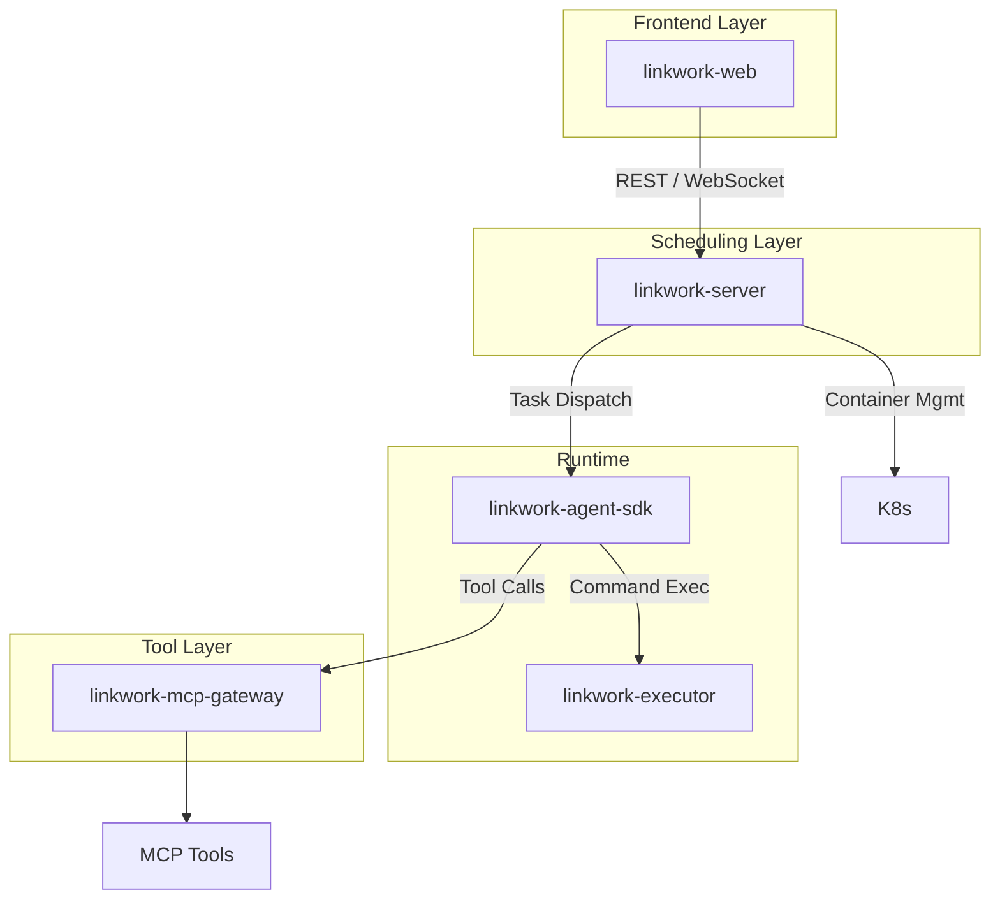

# Core Components

LinkWork consists of five core components, each independently deployed and versioned, collaborating through well-defined interfaces.

---

## Component Overview

---

## linkwork-server — Core Scheduling Engine

The platform's control center, responsible for managing all resources and coordinating workflows.

### Core Responsibilities

| Responsibility | Description |
|---------------|-------------|
| Role Management | Create, configure, build, start/stop, and scale roles |
| Task Orchestration | Receive, dispatch, track status, and archive results |
| Skills Management | Register, version, and manage the Skills marketplace |
| MCP Tool Registration | Register tool services, health checks, permission assignment |
| Approval Workflow | Process approval requests for high-risk operations |
| Image Building | Automatic role image building and version management |
| Scheduled Tasks | Cron-driven planned task management |
| Real-time Communication | WebSocket gateway, event streaming |

### Role Manager

Manages the complete lifecycle of roles: Create → Configure → Build → Start → Run → Scale → Stop.

Built on K8s-native capabilities for container orchestration, supporting:
- Multi-instance parallel execution
- Auto-scaling based on queue depth
- Health checks and failure recovery
- Automatic idle instance reclamation

### Task Orchestrator

Receives user task requests and routes them to the corresponding role's task queue:
- Route by role (each role has an independent task queue)
- Task priority sorting
- Full lifecycle task status management
- Task result archival

---

## linkwork-executor — Secure Executor

The command execution security layer within AI worker containers, ensuring all commands execute within policy constraints.

### Core Responsibilities

| Responsibility | Description |
|---------------|-------------|
| Policy Evaluation | Security assessment of each command via the policy engine |
| Command Execution | Execute commands under security constraints |
| Privilege Separation | Security control process and AI process run as different users |
| Approval Orchestration | Auto-intercept high-risk commands, request human approval |
| Audit Logging | Complete execution record for every command |

### Policy Engine

Performs deep parsing and security assessment of each command, with three possible decisions:

| Decision | Description |
|----------|-------------|
| Allow | Command matches policy, execute directly |
| Deny | Command violates policy, execution prohibited |
| Requires Approval | Command is a high-risk operation, requires human confirmation |

The policy engine doesn't perform simple string matching — it understands command structure and independently evaluates each sub-command within compound commands.

### Privilege Separation

The secure executor and AI runtime run as different users within the same container:
- The AI runtime is completely unaware of the security layer
- Security control processes and AI processes are invisible and inaccessible to each other

---

## linkwork-agent-sdk — Agent Runtime

The core runtime engine for AI workers, responsible for LLM reasoning, task execution, and capability orchestration.

### Core Responsibilities

| Responsibility | Description |
|---------------|-------------|
| Agent Loop | Think → Act → Observe loop driving task execution |
| LLM Calls | Compatible with OpenAI API standard, supports multi-model switching |
| Skills Loading | Load pre-installed Skills from the image, inject into AI context |
| MCP Integration | Load MCP tool configs, register into the runtime |
| Task Consumption | Consume and execute tasks from the task queue |
| Lifecycle Management | Idle timeout detection, graceful shutdown |

### Capability Layer & Constraint Layer

The Agent SDK is internally divided into two layers:

- **Capability Layer**: Skills knowledge injection + MCP tool registration, giving AI workers "the ability to do things"
- **Constraint Layer**: Permission checks + behavior recording, all behavioral intents must pass through the constraint layer before execution

### Multi-model Support

Supports multiple models through a unified LLM interface layer:

| Model | Use Case |
|-------|----------|
| Claude | Complex reasoning, code generation |
| Qwen | General tasks, Chinese optimization |
| DeepSeek | Code generation, reasoning |
| Other OpenAI-compatible models | On-demand integration |

---

## linkwork-mcp-gateway — MCP Tool Gateway

The unified entry point for all external tool calls, providing proxy, auth, and observability capabilities.

### Core Responsibilities

| Responsibility | Description |
|---------------|-------------|
| Tool Routing | Route to the corresponding MCP service by tool name |
| Auth Proxy | Inject auth credentials on behalf of workers — AI workers never hold external credentials directly |
| Health Checks | Periodic probing of all tool services, auto-mark unhealthy services |
| Usage Metering | Call count, latency, error rate, and cost tracking |
| Rate Limiting | Per-service call frequency limits |

---

## linkwork-web — Frontend Reference Implementation

The user-facing web management interface, providing a visual operation portal for all platform features.

### Core Features

| Feature | Description |
|---------|-------------|
| Task Dashboard | Dispatch tasks, real-time execution tracking, view task outputs |
| Role Management | Create/configure/start/stop roles, view instance status |
| Skills Marketplace | Browse, search, and install Skills |
| MCP Tool Management | Register, configure, and monitor MCP tools |
| Approval Center | Process approval requests from AI workers |
| Schedule Management | Configure Cron scheduled tasks |

### Real-time Interaction

Real-time streaming display of task execution via WebSocket:
- AI worker's reasoning process
- Tool calls and command execution
- File changes
- Approval request notifications

---

## Inter-component Communication

| Communication Path | Protocol | Description |
|-------------------|----------|-------------|
| User ↔ linkwork-web | HTTP / WebSocket | Frontend interaction and real-time events |
| linkwork-web ↔ linkwork-server | REST / WebSocket | API calls and event streams |
| linkwork-server → Task Queue | Message Queue | Task dispatch |
| linkwork-agent-sdk ← Task Queue | Message Queue | Task consumption |
| linkwork-agent-sdk → linkwork-executor | IPC | Command execution requests |
| linkwork-agent-sdk → linkwork-mcp-gateway | HTTP | MCP tool calls |
| linkwork-agent-sdk → Event Stream | Message Stream | Real-time execution log streaming |

---

## Further Reading

- [Architecture Overview](./overview.md) — System-level view
- [Data Flow & Real-time Communication](./data-flow.md) — How data flows between components
- [Security Architecture](./security.md) — How the security layer protects command execution
