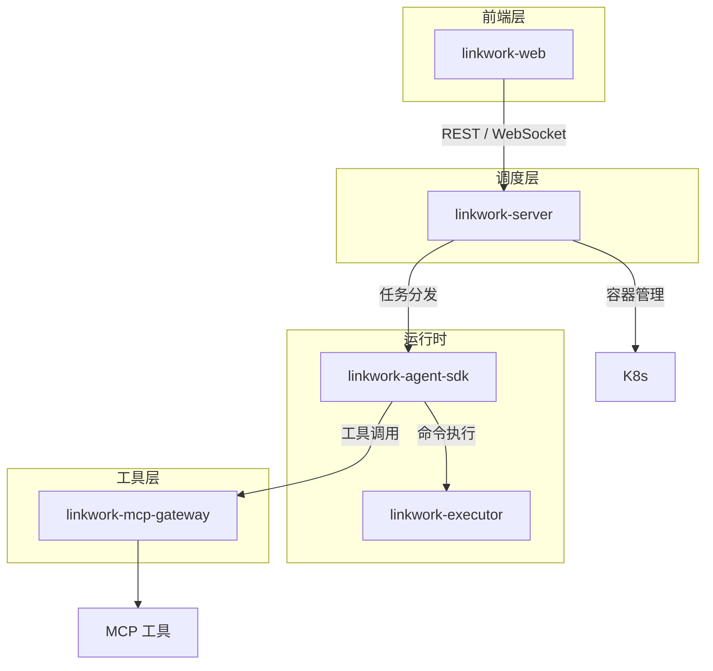

# 核心组件

LinkWork 由五个核心组件构成，各自独立部署、独立版本管理，通过明确的接口协作。

---

## 组件全景

---

## linkwork-server — 核心调度引擎

平台的控制中心，负责管理所有资源和协调工作流。

### 核心职责

| 职责 | 说明 |
|------|------|
| 岗位管理 | 岗位的创建、配置、构建、启停、扩缩容 |
| 任务编排 | 任务接收、分发、状态追踪、结果归档 |
| Skills 管理 | Skills 的注册、版本管理、市场运营 |
| MCP 工具注册 | 工具服务的注册、健康检查、权限分配 |
| 审批流 | 高风险操作的审批请求处理 |
| 镜像构建 | 岗位镜像的自动构建和版本管理 |
| 定时调度 | Cron 驱动的计划任务管理 |
| 实时通信 | WebSocket 网关，事件流式推送 |

### 岗位管理器

管理岗位的完整生命周期：创建 → 配置 → 构建 → 启动 → 运行 → 扩缩容 → 停止。

基于 K8s 原生能力实现容器编排，支持：
- 多实例并行运行
- 基于队列深度的自动扩缩容
- 健康检查与故障恢复
- 空闲实例自动回收

### 任务编排器

接收用户任务请求，路由到对应岗位的任务队列：
- 按岗位路由（每个岗位有独立的任务队列）
- 任务优先级排序
- 任务状态全生命周期管理
- 任务执行结果归档

---

## linkwork-executor — 安全执行器

AI 员工容器内的命令执行安全层，确保所有命令执行在策略约束内。

### 核心职责

| 职责 | 说明 |
|------|------|
| 策略评估 | 基于策略引擎对每条命令做安全评估 |
| 命令执行 | 在安全约束下执行命令 |
| 权限分离 | 安全控制进程与 AI 进程以不同用户运行 |
| 审批编排 | 高风险命令自动拦截，请求人工审批 |
| 审计记录 | 每条命令的完整执行记录 |

### 策略引擎

对每条命令进行深度解析和安全评估，决策结果分为三类：

| 决策 | 说明 |
|------|------|
| 允许 | 命令符合策略，直接执行 |
| 拒绝 | 命令违反策略，禁止执行 |
| 需要审批 | 命令属于高风险操作，需人工确认后执行 |

策略引擎不做简单的字符串匹配，而是理解命令结构，对复合命令中每个子命令独立评估。

### 权限分离

安全执行器与 AI 运行时以不同用户身份运行在同一容器中：
- AI 运行时对安全层完全无感
- 安全控制进程与 AI 进程互不可见、互不可控

---

## linkwork-agent-sdk — Agent 运行时

AI 员工的核心运行引擎，负责 LLM 推理、任务执行和能力编排。

### 核心职责

| 职责 | 说明 |
|------|------|
| Agent 循环 | Think → Act → Observe 循环，驱动任务执行 |
| LLM 调用 | 兼容 OpenAI 接口标准，支持多模型切换 |
| Skills 加载 | 从镜像中加载预装 Skills，注入 AI 上下文 |
| MCP 集成 | 加载 MCP 工具配置，注册到运行时 |
| 任务消费 | 从任务队列消费任务并执行 |
| 生命周期管理 | 空闲超时检测、优雅退出 |

### 能力层与约束层

Agent SDK 内部分为两层：

- **能力层**：Skills 知识注入 + MCP 工具注册，赋予 AI 员工「做事的能力」
- **约束层**：权限检查 + 行为记录，所有行为意图必须经过约束层检查后才能执行

### 多模型支持

通过统一的 LLM 接口层支持多种模型：

| 模型 | 用途 |
|------|------|
| Claude | 复杂推理、代码生成 |
| Qwen | 通用任务、中文优化 |
| DeepSeek | 代码生成、推理 |
| 其他 OpenAI 兼容模型 | 按需接入 |

---

## linkwork-mcp-gateway — MCP 工具网关

所有外部工具调用的统一入口，提供代理、鉴权和可观测能力。

### 核心职责

| 职责 | 说明 |
|------|------|
| 工具路由 | 根据工具名称路由到对应的 MCP 服务 |
| 鉴权代理 | 代为注入鉴权信息，AI 员工不直接持有外部凭证 |
| 健康检查 | 定时探活所有工具服务，自动标记不健康的服务 |
| 用量统计 | 调用次数、延迟、错误率、费用统计 |
| 限流保护 | 按服务配置调用频率限制 |

---

## linkwork-web — 前端参考实现

面向用户的 Web 管理界面，提供平台所有功能的可视化操作入口。

### 核心功能

| 功能 | 说明 |
|------|------|
| 任务面板 | 下发任务、实时追踪执行过程、查看任务产出 |
| 岗位管理 | 创建/配置/启停岗位，查看实例状态 |
| Skills 市场 | 浏览、搜索、安装 Skills |
| MCP 工具管理 | 注册、配置、监控 MCP 工具 |
| 审批中心 | 处理 AI 员工的审批请求 |
| 排班管理 | 配置 Cron 定时任务 |

### 实时交互

通过 WebSocket 实现任务执行的实时流式展示：
- AI 员工的思考过程
- 工具调用和命令执行
- 文件变更
- 审批请求通知

---

## 组件间通信

| 通信路径 | 协议 | 说明 |
|---------|------|------|
| 用户 ↔ linkwork-web | HTTP / WebSocket | 前端交互和实时事件 |
| linkwork-web ↔ linkwork-server | REST / WebSocket | API 调用和事件流 |
| linkwork-server → 任务队列 | 消息队列 | 任务分发 |
| linkwork-agent-sdk ← 任务队列 | 消息队列 | 任务消费 |
| linkwork-agent-sdk → linkwork-executor | 进程间通信 | 命令执行请求 |
| linkwork-agent-sdk → linkwork-mcp-gateway | HTTP | MCP 工具调用 |
| linkwork-agent-sdk → 事件流 | 消息流 | 执行日志实时推送 |

---

## 延伸阅读

- [系统架构总览](./overview_zh-CN.md) — 系统全局视图
- [数据流与实时通信](./data-flow_zh-CN.md) — 数据如何在组件间流转
- [安全架构](./security_zh-CN.md) — 安全层如何保护命令执行
