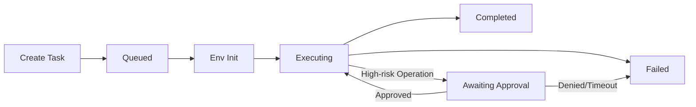
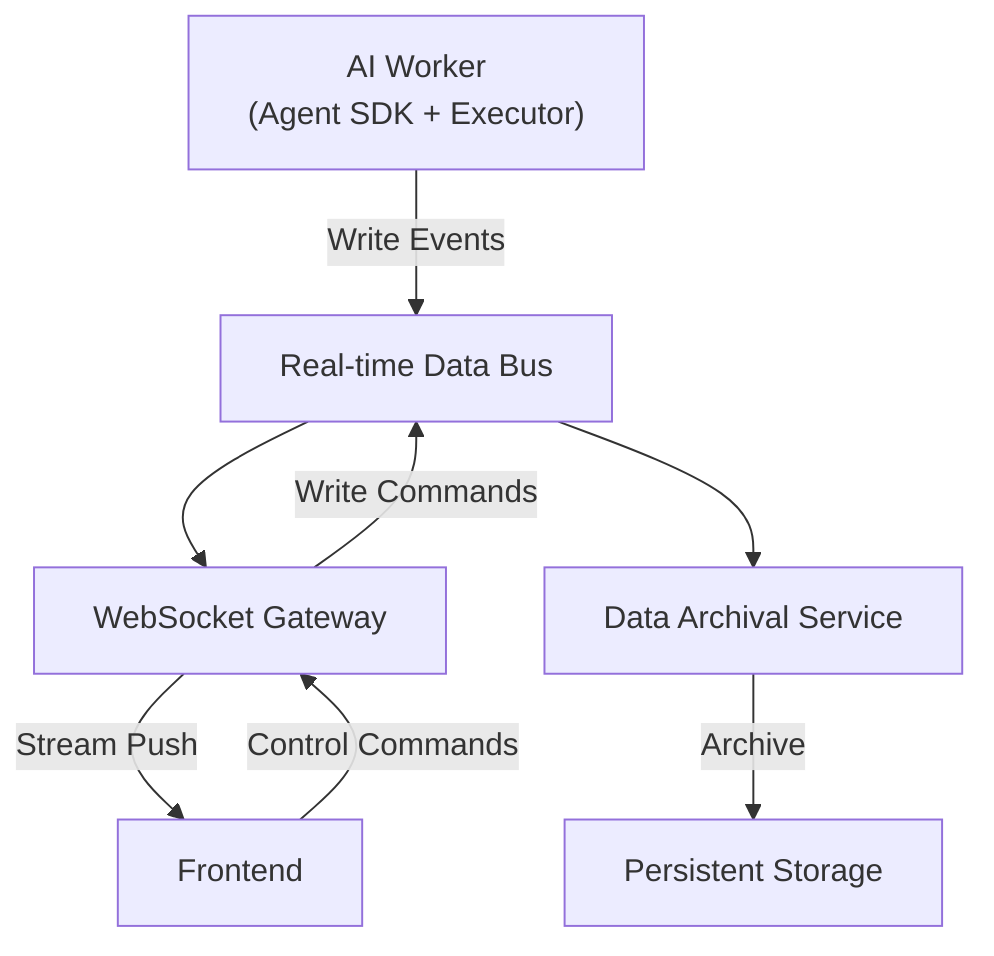

# Data Flow & Real-time Communication

LinkWork is built on an event-driven architecture. All data generated during task execution (reasoning, logs, tool calls, file changes, etc.) flows through a real-time data bus, supporting streaming display and persistent archival.

---

## Task Lifecycle

A task goes through the following stages from creation to completion:

### Stage Descriptions

| Stage | Description |
|-------|-------------|
| Create | User dispatches a task, written to database |
| Queued | Task enters the role's queue, waiting for an idle instance to consume it |
| Env Init | Container startup, Skills sync, Git repo preparation, context assembly |
| Executing | AI worker loops through Think → Act → Observe |
| Awaiting Approval | High-risk operation encountered, paused waiting for human confirmation |
| Completed | Task output archived, resources reclaimed |
| Failed | Abnormal termination, error information recorded |

---

## Real-time Event Stream

During task execution, all events produced by AI workers are pushed through the real-time data bus, enabling streaming display on the frontend.

### Event Categories

| Category | Direction | Typical Events |
|----------|-----------|---------------|
| Execution Events | AI → Frontend | Session start/end, reasoning process, tool calls and results, status updates |
| Security Events | Executor → Frontend | Command allow/deny, approval requests, approval results |
| File Events | AI → Frontend | File directory snapshots, file content changes |
| Control Commands | Frontend → AI | Approval confirmation, pause/resume, interrupt/cancel |
| Container Events | Platform → Frontend | Container start/stop, environment init, image building |

### Data Flow Model

- **Write**: AI workers append events to the data bus (time-series data)
- **Real-time Push**: WebSocket gateway consumes events in real time and pushes them to the frontend
- **Persistence**: Archival service asynchronously consumes events and persists them to object storage

### Task Isolation

Each task has an independent event stream with naturally isolated data:
- Events from different tasks do not interfere with each other
- The frontend subscribes per task, receiving only events for the task of interest
- Archival is packaged per task

---

## Bidirectional Communication

LinkWork supports bidirectional real-time communication between the frontend and AI workers:

### AI → Frontend (Event Push)

The frontend connects to the platform via WebSocket and receives AI worker execution events in real time:

- **Reasoning Process**: AI's reasoning and decision process, streamed live
- **Tool Calls**: Parameters and results of each tool invocation
- **Command Execution**: Command content, execution output, exit codes
- **File Changes**: Which files were modified and the change content

### Frontend → AI (Control Commands)

Users can send control commands to running AI workers through the frontend:

| Command | Description |
|---------|-------------|
| Approval Confirmation | Approve or reject approval requests for high-risk operations |
| Pause/Resume | Pause or resume task execution |
| Interrupt/Cancel | Interrupt the current operation or cancel the entire task |

---

## History Replay

Beyond real-time streaming, LinkWork supports complete replay of task execution history:

- **Online Replay**: During task execution, the frontend can fetch historical events at any time
- **Archival Query**: After task completion, event logs are persisted to object storage for audit queries

### Archival Strategy

| Trigger Condition | Action |
|------------------|--------|
| Task Completed | Upload event logs to object storage |
| Heartbeat Timeout | Auto-trigger archival after timeout |
| Archival Complete | Clean up real-time data, release resources |

Archived files are stored in a structured format by `year/month/day/taskID`, supporting retrieval by time range and task ID.

---

## Output Delivery

After task completion, deliverables follow clear delivery modes:

| Mode | Description |
|------|-------------|
| Git Mode | Auto commit/push to a working branch, create Merge Request |
| OSS Mode | Output files archived to object storage, stored in structured paths |

Not a chat transcript — **engineering deliverables ready to merge and deploy**.

---

## Further Reading

- [Core Components](./components.md) — Each component's role in the data flow
- [Security Architecture](./security.md) — How security events integrate into the data flow
- [Architecture Overview](./overview.md) — System-level view
