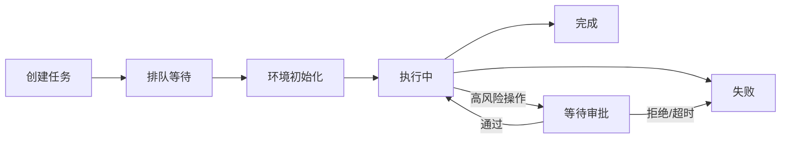
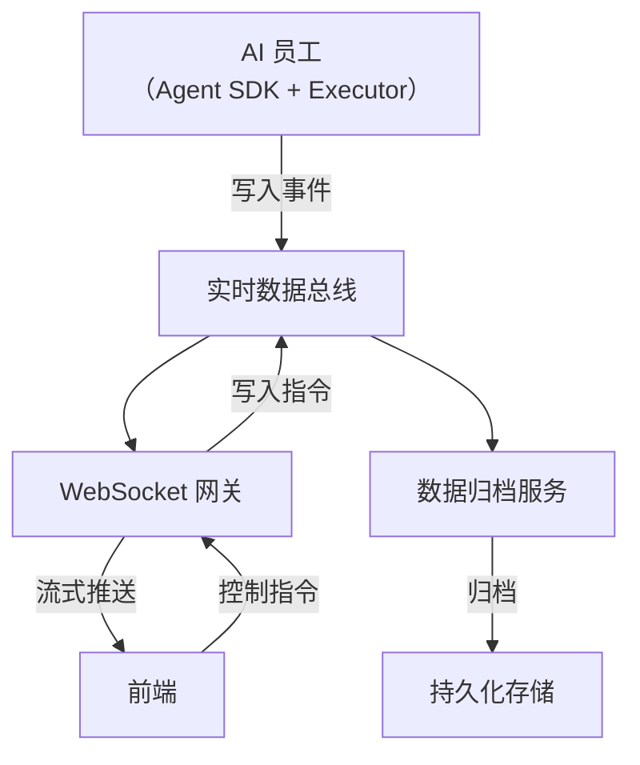

# 数据流与实时通信

LinkWork 基于事件驱动架构，任务执行过程中的所有数据（思考、日志、工具调用、文件变更等）通过实时数据总线流转，支持流式展示和持久化归档。

---

## 任务生命周期

一个任务从创建到完成，经历以下阶段：

### 各阶段说明

| 阶段 | 说明 |
|------|------|
| 创建 | 用户下发任务，写入数据库 |
| 排队 | 任务进入岗位队列，等待空闲实例消费 |
| 环境初始化 | 容器启动、Skills 同步、Git 仓库准备、上下文装配 |
| 执行中 | AI 员工循环执行 Think → Act → Observe |
| 等待审批 | 遇到高风险操作，暂停等待人工确认 |
| 完成 | 任务产出归档，资源回收 |
| 失败 | 异常终止，记录错误信息 |

---

## 实时事件流

任务执行过程中，AI 员工产生的所有事件通过实时数据总线推送，前端可流式展示。

### 事件分类

| 分类 | 方向 | 典型事件 |
|------|------|---------|
| 执行事件 | AI → 前端 | 会话开始/结束、思考过程、工具调用及结果、状态更新 |
| 安全事件 | 执行器 → 前端 | 命令允许/拒绝、审批请求、审批结果 |
| 文件事件 | AI → 前端 | 文件目录快照、文件内容变更 |
| 控制指令 | 前端 → AI | 审批确认、暂停/恢复、中断/取消 |
| 容器事件 | 平台 → 前端 | 容器启动/停止、环境初始化、镜像构建 |

### 数据流模型

- **写入**：AI 员工将事件追加到数据总线（时序数据）
- **实时推送**：WebSocket 网关实时消费事件，推送给前端
- **持久化**：归档服务异步消费事件，持久化到对象存储

### 任务隔离

每个任务有独立的事件流，数据天然隔离：
- 不同任务的事件互不干扰
- 前端按任务订阅，只接收关注的任务事件
- 归档时按任务为单位打包

---

## 双向通信

LinkWork 支持前端与 AI 员工的双向实时通信：

### AI → 前端（事件推送）

前端通过 WebSocket 连接到平台，实时接收 AI 员工的执行事件：

- **思考过程**：AI 的推理和决策过程，流式展示
- **工具调用**：每次工具调用的参数和结果
- **命令执行**：命令内容、执行输出、退出码
- **文件变更**：修改了哪些文件、变更内容

### 前端 → AI（控制指令）

用户可以通过前端向正在执行的 AI 员工发送控制指令：

| 指令 | 说明 |
|------|------|
| 审批确认 | 确认或拒绝高风险操作的审批请求 |
| 暂停/恢复 | 暂停或恢复任务执行 |
| 中断/取消 | 中断当前操作或取消整个任务 |

---

## 历史回溯

除了实时推送，LinkWork 还支持任务执行历史的完整回溯：

- **在线回溯**：任务执行期间，前端可随时拉取历史事件
- **归档查询**：任务完成后，事件日志持久化到对象存储，支持审计查询

### 归档策略

| 触发条件 | 动作 |
|---------|------|
| 任务完成 | 上传事件日志到对象存储 |
| 心跳超时 | 超时后自动触发归档 |
| 归档完成 | 清理实时数据，释放资源 |

归档文件按 `年/月/日/任务ID` 结构化存储，支持按时间范围和任务 ID 检索。

---

## 产出交付

任务完成后，产出物有明确的交付模式：

| 模式 | 说明 |
|------|------|
| Git 模式 | 自动 commit/push 到工作分支，创建 Merge Request |
| OSS 模式 | 产出文件归档到对象存储，按结构化路径存储 |

不是一段聊天记录，而是**可入库、可合并、可部署的工程交付物**。

---

## 延伸阅读

- [核心组件](./components_zh-CN.md) — 各组件在数据流中的角色
- [安全架构](./security_zh-CN.md) — 安全事件如何融入数据流
- [系统架构总览](./overview_zh-CN.md) — 全局视图
