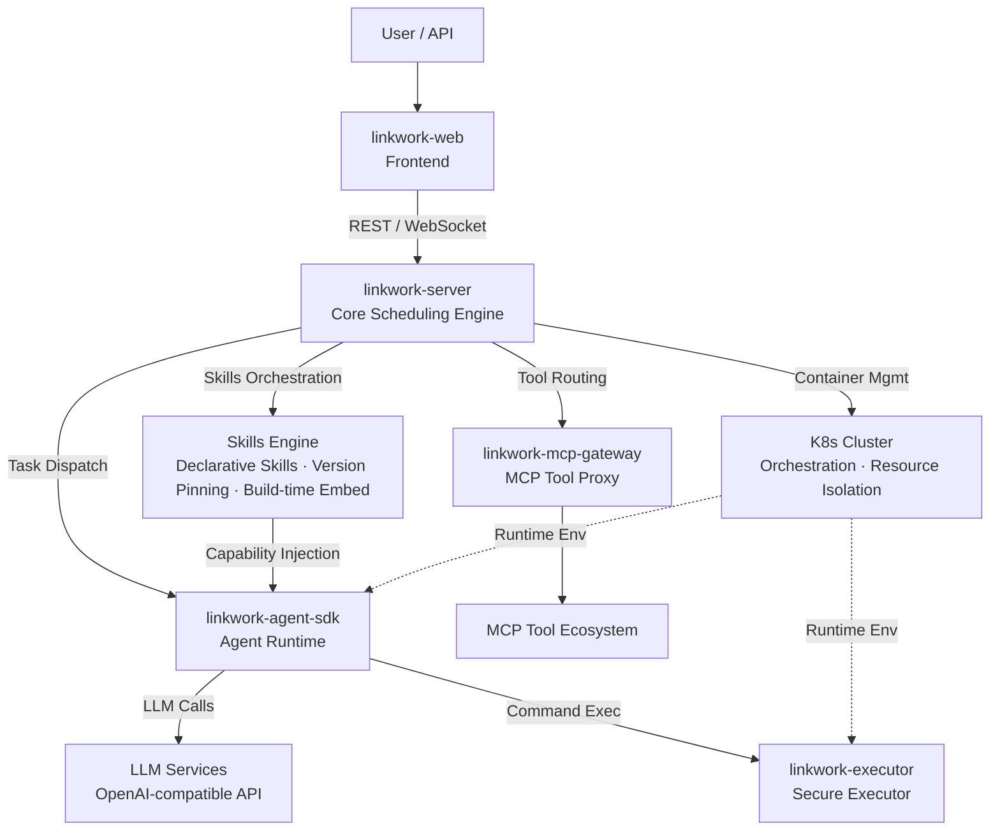
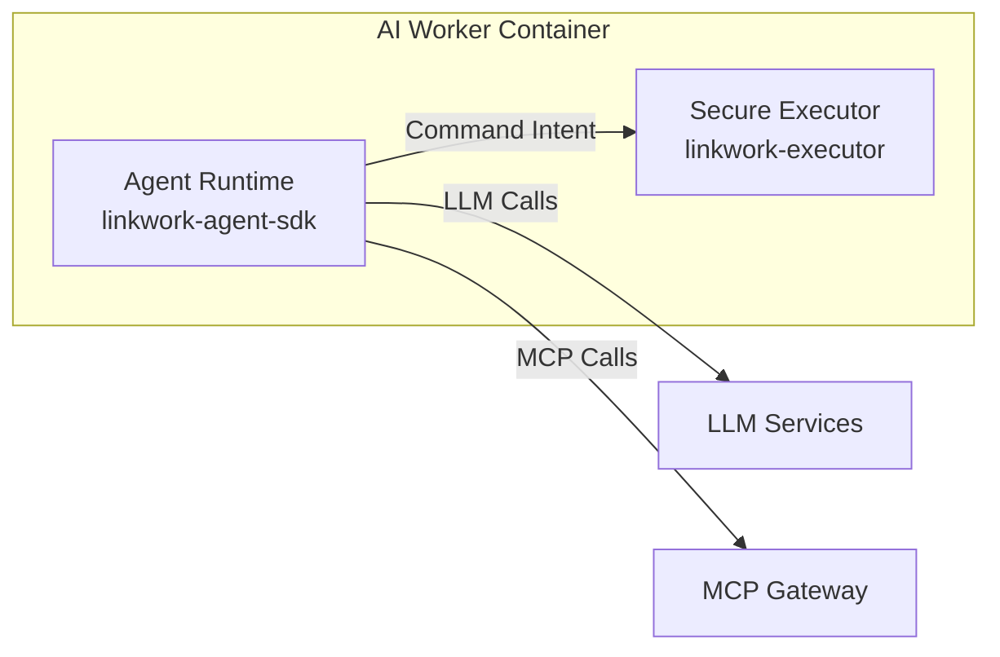

# Architecture Overview

LinkWork is an enterprise-grade AI workforce platform built on a containerized microservice architecture, centered around the **Workstation (Role)** model.

---

## System Context

### Workflow

User creates a task → Scheduling engine allocates a container in the K8s cluster → Agent runtime starts in an isolated environment → Calls LLM for reasoning, securely executes commands through the executor → MCP gateway proxies external tool calls → Execution status streams back in real time.

---

## Five Core Components

| Component | Role | Tech Stack |
|-----------|------|------------|
| **linkwork-server** | Core scheduling engine — role management, task orchestration, Skills & tool registry, approval workflow | Java / Spring Boot |
| **linkwork-executor** | Secure executor — in-container command execution, policy engine, privilege separation | Go |
| **linkwork-agent-sdk** | Agent runtime — LLM reasoning engine, Skills orchestration, MCP integration | Python |
| **linkwork-mcp-gateway** | MCP tool gateway — tool discovery, auth proxy, health checks, usage metering | Go |
| **linkwork-web** | Frontend reference — task dashboard, role configuration, Skills marketplace, real-time monitoring | TypeScript / Vue 3 |

---

## Container Architecture

All LinkWork AI workers run in container environments, supporting two deployment modes:

### Docker Compose (Development / Small Scale)

Suitable for local development and small teams, all services running on a single machine.

### K8s Cluster (Production)

Suitable for enterprise production environments, fully leveraging container orchestration capabilities:

| Capability | Description |
|-----------|-------------|
| Smart Scheduling | Priority-based resource allocation, queuing when busy, releasing when idle |
| Elastic Scaling | Auto scale up/down based on task volume |
| Resource Isolation | Independent resource quotas per role |
| Self-healing | Auto-restart on container crash |

---

## Workstation Runtime Model

Each AI role maps to a set of resources in K8s:

| Role Concept | Runtime Mapping |
|-------------|----------------|
| Workstation (Role) | Container orchestration unit + config |
| Instance | Container instance |
| Task Queue | Message queue |

### AI Worker Container Internal Structure

Each AI worker container runs two core processes:

- **Agent Runtime**: Responsible for LLM reasoning, task planning, and tool invocation
- **Secure Executor**: Responsible for command execution, policy evaluation, and security auditing

The two processes run under different user identities with fully separated privileges, invisible to each other.

---

## Further Reading

- [Core Components](./components.md) — Detailed responsibilities of each component
- [Data Flow & Real-time Communication](./data-flow.md) — How task data flows through the system
- [Security Architecture](./security.md) — Multi-layer security protection
- [Workstation Model](../concepts/workstation.md) — Conceptual design of workstations
