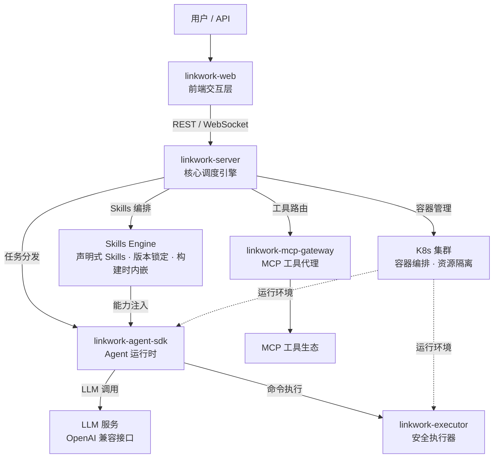
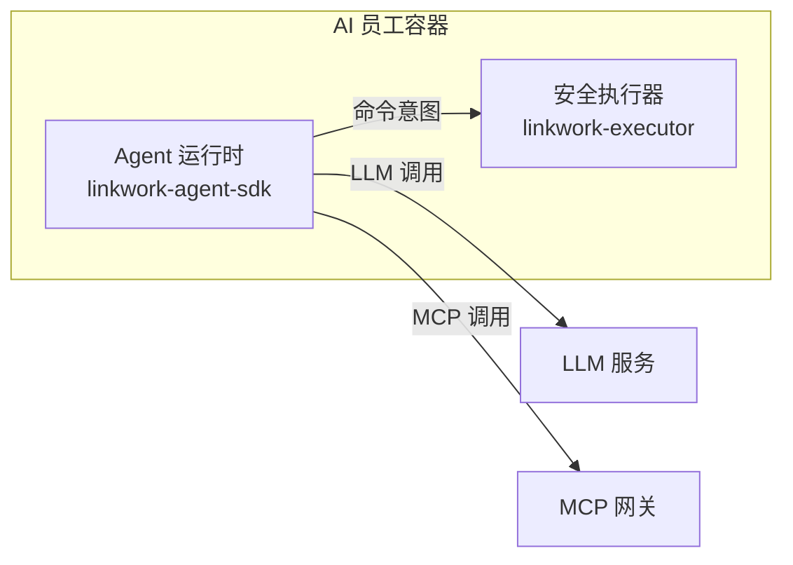

# 系统架构总览

LinkWork 是一个企业级 AI 劳动力平台，采用容器化微服务架构，核心围绕**岗位（Workstation）**模型构建。

---

## 系统上下文

### 工作流程

用户创建任务 → 调度引擎在 K8s 集群中分配容器 → Agent 运行时在隔离环境中启动 → 调用 LLM 推理、通过执行器安全执行命令 → MCP 网关代理外部工具调用 → 全程实时回传执行状态。

---

## 五大组件

| 组件 | 定位 | 技术栈 |
|------|------|--------|
| **linkwork-server** | 核心调度引擎 — 岗位管理、任务编排、Skills 与工具注册、审批流 | Java / Spring Boot |
| **linkwork-executor** | 安全执行器 — 容器内命令执行、策略引擎、权限分离 | Go |
| **linkwork-agent-sdk** | Agent 运行时 — LLM 推理引擎、Skills 编排、MCP 集成 | Python |
| **linkwork-mcp-gateway** | MCP 工具网关 — 工具发现、鉴权代理、健康检查、用量统计 | Go |
| **linkwork-web** | 前端参考实现 — 任务面板、岗位配置、Skills 市场、实时监控 | TypeScript / Vue 3 |

---

## 容器架构

LinkWork 的所有 AI 员工运行在容器环境中，支持两种部署模式：

### Docker Compose（开发 / 小规模）

适用于本地开发和小团队使用，所有服务在单机运行。

### K8s 集群（生产）

适用于企业生产环境，完整发挥容器编排能力：

| 能力 | 说明 |
|------|------|
| 智能调度 | 按优先级分配资源，忙时排队、闲时释放 |
| 弹性伸缩 | 按任务量自动扩缩容 |
| 资源隔离 | 每个岗位独立资源配额 |
| 故障自愈 | 容器崩溃自动重启 |

---

## 岗位运行模型

每个 AI 岗位在 K8s 中映射为一组资源：

| 岗位概念 | 运行时映射 |
|---------|-----------|
| 岗位（Workstation） | 容器编排单元 + 配置 |
| 实例（Instance） | 容器实例 |
| 任务队列 | 消息队列 |

### AI 员工容器内部结构

每个 AI 员工容器内运行两个核心进程：

- **Agent 运行时**：负责 LLM 推理、任务规划、工具调用
- **安全执行器**：负责命令执行、策略评估、安全审计

两个进程以不同用户身份运行，权限完全分离，互不可见。

---

## 延伸阅读

- [核心组件](./components_zh-CN.md) — 各组件的详细职责
- [数据流与实时通信](./data-flow_zh-CN.md) — 任务数据如何流转
- [安全架构](./security_zh-CN.md) — 多层安全防护体系
- [岗位模型](../concepts/workstation_zh-CN.md) — 岗位的概念设计
