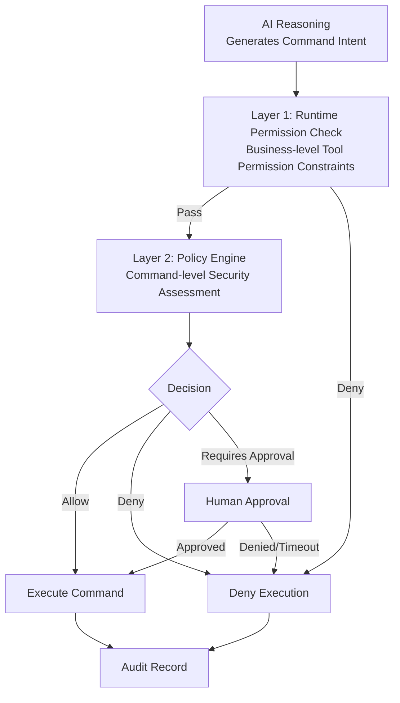

# Security Architecture

LinkWork treats security as a first-class citizen. All AI behavioral intents must pass through multiple security layers — each layer is inescapable.

---

## Security Goals

| Goal | Description |
|------|-------------|
| Decision-Execution Separation | AI reasoning and command execution are performed by different processes, running as different users |
| Command Auditability | Full-chain recording of every command's request, evaluation, execution, and result |
| Credential Invisibility | Sensitive credentials are invisible and unreadable to AI workers |
| Fail-closed by Default | When any security component fails, execution is denied by default |

---

## Multi-layer Security Model

LinkWork employs a defense-in-depth strategy with security checks throughout the entire command execution chain:



### Layer 1: Runtime Permission Check

Within the Agent SDK, business-level permission checks are performed before tool invocation:
- Verify whether the current role has permission to use the tool
- Make rapid ALLOW / DENY decisions based on preset rules

### Layer 2: Policy Engine

In the secure executor, each command undergoes deep security assessment:

- **Deep Command Parsing** — Not simple string matching, but understanding command structure
- **Compound Command Decomposition** — Each sub-command within pipes, chains, and nested commands is independently evaluated
- **Three Decisions** — Allow (execute directly) / Deny (execution prohibited) / Requires Approval (human confirmation)

---

## AI Is Unaware of the Security Layer

LinkWork's security layer is **completely transparent** to AI workers:

- AI workers believe they are executing commands directly throughout the entire process
- The security proxy layer is invisible to AI
- This fundamentally prevents AI from attempting to bypass the security layer

This is not a "prompt barrier" that can be bypassed by prompt injection — it's OS-level process isolation.

---

## Privilege Separation

Within the same AI worker container, the security control process and AI task process run independently:

| Dimension | AI Process | Security Control Process |
|-----------|-----------|------------------------|
| Run User | Regular user | Dedicated security user |
| Visibility | Invisible to each other | Invisible to each other |
| Control | Cannot control each other | Cannot control each other |
| Credential Access | Cannot access security credentials | Holds security credentials |

### Least Privilege Principle

- Regular commands execute with AI user privileges (de-escalated)
- Only approval-cleared high-privilege operations execute as the security user
- Dangerous system commands (e.g., privilege escalation, process manipulation) are denied by default

---

## Approval Workflow

High-risk operations are not directly denied — they enter an approval process:

```
Command triggered → Policy evaluates as "requires approval" → Create approval request → Notify approver
    → Approver confirms: Approved → Execute command
    → Approver confirms: Denied → Deny execution
    → Timeout (default deny) → Deny execution
```

### Approval Features

| Feature | Description |
|---------|-------------|
| Real-time Notification | Approval requests pushed to the frontend via WebSocket in real time |
| Timeout Policy | Approval timeout defaults to deny (fail-closed) |
| Context Display | Approval interface shows command content, execution context, and risk level |

---

## Network Security

AI worker network access follows a **default-deny** policy:

- Containers cannot access external networks by default
- Only necessary service addresses are whitelisted on demand (LLM API, MCP tools, etc.)
- All external tool calls go through the MCP gateway proxy — AI workers cannot connect to external services directly

---

## Credential Protection

| Credential Type | Protection Method |
|----------------|-------------------|
| LLM API Key | Environment variable injection, unreadable by AI process |
| MCP Tool Auth | Gateway proxy injection, not held by AI |
| Git Token | Managed by security process, encrypted storage |
| SSH Keys | Managed by security process, inaccessible to AI |

---

## Audit Closure

All security-related events form a complete audit closure:

### Audit Scope

| Event | Recorded Content |
|-------|-----------------|
| Command Request | Command content, request time, source task |
| Policy Evaluation | Evaluation result (allow/deny/approval), matched policy rules |
| Approval Process | Approval request, approver, approval result, duration |
| Command Execution | Execution result, output content, exit code |

### Dual Log System

LinkWork maintains two independent logging systems:

| Log | Purpose | Audience |
|-----|---------|----------|
| Execution Log | User-facing real-time observability, full task execution process | Users and admins |
| Audit Log | Security compliance auditing, command-level detailed records | Security team |

The two log systems are correlated by task ID, enabling cross-query for deep auditing.

---

## Failure Policy

The following scenarios all default to deny execution (fail-closed):

- Policy engine exception
- Approval system unavailable
- Approval timeout
- Auth verification failure

**No security component failure should result in an unchecked command being executed.**

---

## Further Reading

- [Core Components](./components.md) — The secure executor's role within the component architecture
- [Data Flow & Real-time Communication](./data-flow.md) — How security events integrate into the data flow
- [Workstation Model](../concepts/workstation.md) — The relationship between roles and security policies
