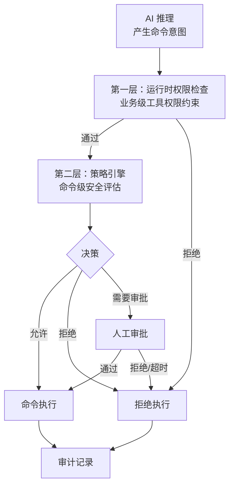

# 安全架构

LinkWork 将安全作为一等公民。所有 AI 行为意图必须经过多层安全检查，每一层都无法绕过。

---

## 安全目标

| 目标 | 说明 |
|------|------|
| 决策与执行分离 | AI 推理和命令执行由不同进程、不同用户完成 |
| 命令可审计 | 每条命令的请求、评估、执行、结果全链路记录 |
| 凭证不可见 | 敏感凭证对 AI 员工不可见、不可读 |
| 故障默认拒绝 | 任何安全组件故障时，默认拒绝执行（fail-closed） |

---

## 多层安全模型

LinkWork 采用纵深防御策略，安全检查贯穿整个命令执行链路：



### 第一层：运行时权限检查

在 Agent SDK 内部，工具调用前进行业务级权限检查：
- 检查当前岗位是否有权使用该工具
- 基于预设规则做快速 ALLOW / DENY 决策

### 第二层：策略引擎

在安全执行器中，对每条命令进行深度安全评估：

- **深度命令解析** — 不做简单字符串匹配，而是理解命令结构
- **复合命令拆解** — 对管道、链式、嵌套命令中每个子命令独立评估
- **三种决策** — 允许（直接执行）/ 拒绝（禁止执行）/ 需要审批（人工确认）

---

## AI 对安全层无感

LinkWork 的安全层对 AI 员工是**完全透明**的：

- AI 员工全程认为自己在直接执行命令
- 安全代理层对 AI 不可见
- 从根本上防止 AI 尝试绕过安全层

这不是一个可以被 Prompt 注入绕过的「提示词屏障」，而是操作系统级别的进程隔离。

---

## 权限分离

同一个 AI 员工容器内，安全控制进程与 AI 任务进程各自独立运行：

| 维度 | AI 进程 | 安全控制进程 |
|------|--------|-------------|
| 运行用户 | 普通用户 | 专用安全用户 |
| 可见性 | 互不可见 | 互不可见 |
| 控制关系 | 无法控制对方 | 无法控制对方 |
| 凭证访问 | 不可访问安全凭证 | 持有安全凭证 |

### 最小权限原则

- 普通命令以 AI 用户身份降权执行
- 仅审批通过的高权操作以安全用户身份执行
- 危险系统命令（如提权、进程操控）默认禁止

---

## 审批流

高风险操作不是直接拒绝，而是进入审批流程：

```
命令触发 → 策略评估为"需要审批" → 创建审批请求 → 通知审批人
    → 审批人确认：通过 → 执行命令
    → 审批人确认：拒绝 → 拒绝执行
    → 超时（默认拒绝） → 拒绝执行
```

### 审批特性

| 特性 | 说明 |
|------|------|
| 实时通知 | 审批请求通过 WebSocket 实时推送到前端 |
| 超时策略 | 审批超时默认拒绝（fail-closed） |
| 上下文展示 | 审批界面展示命令内容、执行上下文和风险等级 |

---

## 网络安全

AI 员工的网络访问采用**默认关闭**策略：

- 容器默认无法访问外部网络
- 仅按需放行必要的服务地址（LLM API、MCP 工具等）
- 所有外部工具调用通过 MCP 网关代理，不允许 AI 直连

---

## 凭证保护

| 凭证类型 | 保护方式 |
|---------|---------|
| LLM API Key | 环境变量注入，AI 进程不可读源 |
| MCP 工具鉴权 | 网关代理注入，AI 不持有 |
| Git Token | 安全进程管理，加密存储 |
| SSH 密钥 | 安全进程管理，AI 不可访问 |

---

## 审计闭环

所有安全相关事件形成完整的审计闭环：

### 审计范围

| 事件 | 记录内容 |
|------|---------|
| 命令请求 | 命令内容、请求时间、来源任务 |
| 策略评估 | 评估结果（允许/拒绝/审批）、匹配的策略规则 |
| 审批流程 | 审批请求、审批人、审批结果、耗时 |
| 命令执行 | 执行结果、输出内容、退出码 |

### 双日志体系

LinkWork 维护两套独立的日志系统：

| 日志 | 用途 | 受众 |
|------|------|------|
| 执行日志 | 用户侧实时可观测，任务执行全过程 | 用户和管理员 |
| 审计日志 | 安全合规审计，命令级别的详细记录 | 安全团队 |

两套日志通过任务 ID 关联，需要深入审计时可交叉查询。

---

## 失败策略

以下场景均默认拒绝执行（fail-closed）：

- 策略引擎异常
- 审批系统不可用
- 审批超时
- 鉴权校验失败

**任何安全组件的故障都不应该导致未经检查的命令被执行。**

---

## 延伸阅读

- [核心组件](./components_zh-CN.md) — 安全执行器的组件定位
- [数据流与实时通信](./data-flow_zh-CN.md) — 安全事件如何融入数据流
- [岗位模型](../concepts/workstation_zh-CN.md) — 岗位与安全策略的关系
